# AI Skin Lesion Pre-Screening (Capstone MVP)

**Decision-support prototype only. Not a diagnosis. Consult a qualified clinician.**

An explainable, uncertainty-aware skin lesion pre-screening prototype for places where dermatologists are scarce, starting with Rwanda. You upload a photo of a skin lesion and the app returns:

- the most likely lesion class out of 7, with a probability for each class
- an uncertainty level, and a "Review recommended" warning when the model is unsure or sees a possible melanoma
- a heatmap (Grad-CAM) showing which part of the image influenced the result

Author: Kayonga Elvis (African Leadership University, BSc Software Engineering, Capstone)

Links:

- GitHub repo: https://github.com/Elvis-Kayonga/ai-skin-lesion-detection-system-capstone-project
- Demo video: [(https://youtu.be/xynFxpXcZa8)
](https://youtu.be/xynFxpXcZa8)


> **Please read the Limitations section before judging the results.** The model was trained on a dataset that is mostly light-skinned patients and has not been tested on Black or dark skin. This project does not claim it works for dark skin. Measuring that is the main future work.

---

## Contents

1. [What is in this repo](#1-what-is-in-this-repo)
2. [Quick start (about 10 minutes)](#2-quick-start)
3. [How to use the app](#3-how-to-use-the-app)
4. [Results (real numbers from the training run)](#4-results)
5. [Designs and screenshots](#5-designs-and-screenshots)
6. [API summary](#6-api-summary)
7. [Deployment plan](#7-deployment-plan)
8. [Limitations](#8-limitations)
9. [Retraining the model](#9-retraining-the-model)
10. [Data, licences and credits](#10-data-licences-and-credits)

---

## 1. What is in this repo

```
backend/          FastAPI server, model code, database, upload checks
  model/          trained weights and model_config.json
frontend/         React web app (Vite)
notebooks/        Colab notebook: data charts, model, training, metrics
docs/             figures, result tables, screenshots, demo script
sample_images/    a few images to try the app with
docker-compose.yml   production-style setup (PostgreSQL + API + web)
```

Tech: Python, PyTorch (EfficientNet-B3), Grad-CAM, FastAPI, SQLite (PostgreSQL for production), React.

## 2. Quick start

You need Python 3.10 or newer and Node.js 18 or newer. The commands below are for Windows PowerShell. On macOS or Linux use `source .venv/bin/activate` instead of the activate line.

### Step 1: Start the backend

```powershell
cd backend
python -m venv .venv
.venv\Scripts\activate
pip install -r requirements.txt
```

Create your `.env` file (this makes a random secret key for login tokens):

```powershell
python -c "import secrets; open('.env','w').write('SECRET_KEY='+secrets.token_hex(32)+'\n')"
```

Run the server:

```powershell
uvicorn app.main:app --reload
```

Check it worked: open http://localhost:8000/health. You should see `"model_loaded": true`. The interactive API page (Swagger UI) is at http://localhost:8000/docs.

The server refuses to start without a secret key of at least 32 characters. This is on purpose, so nobody can run it with a guessable key.

### Step 2: Start the web app

Open a second terminal:

```powershell
cd frontend
npm install
npm run dev
```

Open http://localhost:5173 in your browser.

### Troubleshooting

| Problem | Fix |
|---|---|
| `SECRET_KEY is missing or too short` | Run the `.env` command in Step 1 from inside the `backend` folder |
| `/health` says `model_loaded: false` | Check that `backend/model/` has `efficientnet_b3_best.pth` and `model_config.json` |
| Web app cannot reach the API | Make sure the backend is running on port 8000 and you opened the web app at `localhost:5173` or `127.0.0.1:5173` |
| First analysis takes 15 to 35 seconds | Normal. The model warms up on the first image. Later images take about 2 seconds on a laptop CPU |

## 3. How to use the app

There is no login screen. Open http://localhost:5173 and you are straight in.

1. Add a photo in one of three ways: click **Take a photo** to use your camera, click **Upload a photo**, or drag and drop a file onto the box.
2. Click **Analyse image**.
3. Read the result card: most likely class, uncertainty meter, probability bars, and the heatmap next to your photo.
4. Try `blurry_example_will_be_rejected.jpg` and `not_an_image_will_be_rejected.txt` from `sample_images/` to see the quality checks reject bad input with a clear message.
5. Open **History** to see past cases, and **Limitations** for the full limitations panel. A short version is also shown on the main screen.

Camera notes: browsers only allow camera access on `localhost` or on an HTTPS site, and you must click Allow when asked. On a phone without in-page camera support, **Take a photo** opens the phone's own camera instead. If the camera is blocked, the app says so and you can upload a photo instead.

Privacy note: with no login, the app quietly creates a private anonymous session in your browser the first time you open it. Your history belongs to that browser only. Clearing your browser data removes the link to your past cases. The server still requires a token for every prediction and history request, so one visitor cannot see another visitor's cases.

The sample images come from the HAM10000 dataset. **They may have been part of the training data, so do not treat their results as a measure of accuracy.** They are only there so you can try the interface. Real accuracy figures are in the Results section.

## 4. Results

All numbers below come from the training notebook run on Google Colab (files in `docs/results/` and `backend/model/model_config.json`). Nothing was typed in by hand.

**Setup:** HAM10000 (10,015 dermoscopic images, 7 classes). Split into train, validation and test by lesion (not by image), so the same lesion never appears in two sets. The test set has 1,441 images.

### Model comparison on the test set

| Model | Accuracy | Macro precision | Macro recall | Macro F1 | Macro AUC | Melanoma sensitivity |
|---|---|---|---|---|---|---|
| EfficientNet-B3 (proposed) | 83.5% | 0.731 | 0.743 | 0.732 | 0.963 | 57.5% |
| MobileNetV2 (baseline) | 81.0% | 0.650 | 0.722 | 0.673 | 0.954 | 41.8% |

Why macro averages: about 67% of the data is one class (nv, common moles), so plain accuracy looks good even for a weak model. Macro averages treat all 7 classes equally.

### EfficientNet-B3, per class (test set)

| Class | Precision | Recall | F1 | Test images |
|---|---|---|---|---|
| akiec (actinic keratoses) | 0.450 | 0.529 | 0.487 | 34 |
| bcc (basal cell carcinoma) | 0.729 | 0.876 | 0.796 | 89 |
| bkl (benign keratosis-like) | 0.772 | 0.566 | 0.653 | 168 |
| df (dermatofibroma) | 0.875 | 0.778 | 0.824 | 9 |
| mel (melanoma) | 0.491 | 0.575 | 0.530 | 146 |
| nv (melanocytic nevi) | 0.930 | 0.925 | 0.927 | 974 |
| vasc (vascular lesions) | 0.870 | 0.952 | 0.909 | 21 |

The df and vasc classes have very few test images (9 and 21), so their scores are unreliable.

### Uncertainty and the "Review recommended" flag

The app runs the classifier 10 times with dropout switched on (MC Dropout) and averages the results. The spread between runs is measured as entropy. An image is flagged for review when entropy is at least 0.413, or when the melanoma probability is at least 5%. Both thresholds were chosen on the validation set, not the test set.

| Measure (test set) | Value |
|---|---|
| Images flagged for review | 31.3% |
| Accuracy on images not flagged | 93.5% |
| Accuracy on images flagged | 61.6% |
| Model mistakes that were flagged | 73.0% |
| Melanoma sensitivity, top class only | 61.0% |
| Melanoma sensitivity, counting a flag as a catch | 87.7% |

In plain words: the flag works as a useful warning. The model is much more accurate on images it is not worried about. But even with the flag, about 1 in 8 melanomas in the test set was neither correctly named nor flagged.

### Charts

| | |
|---|---|
| 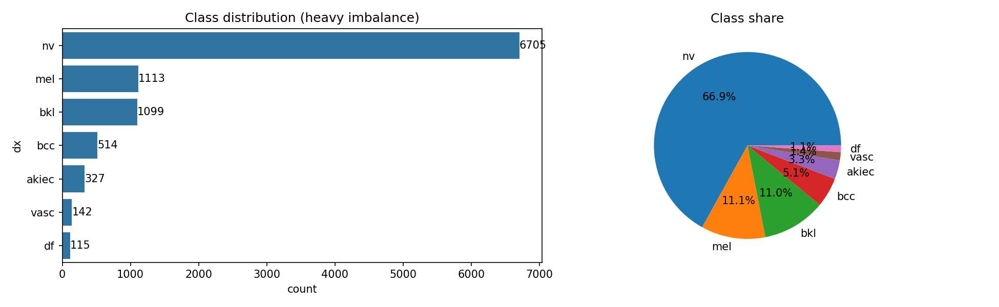 | 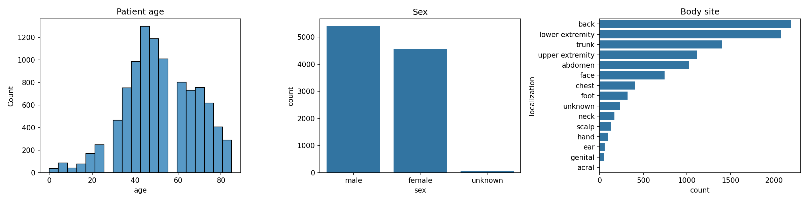 |
| 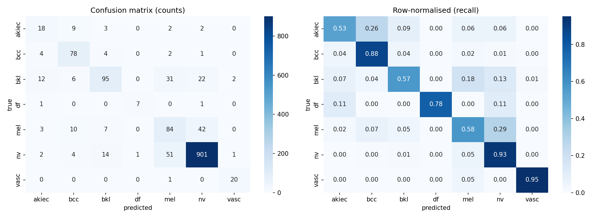 | 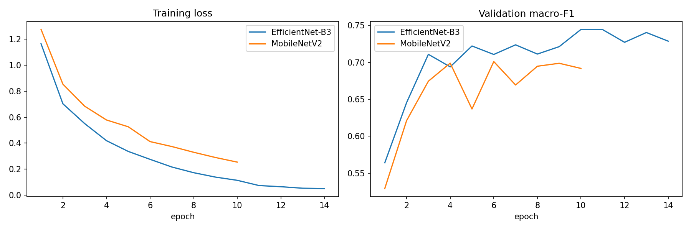 |
| 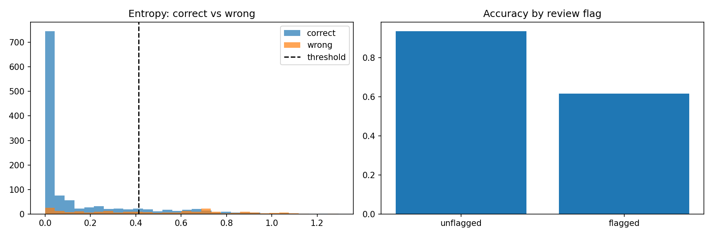 | 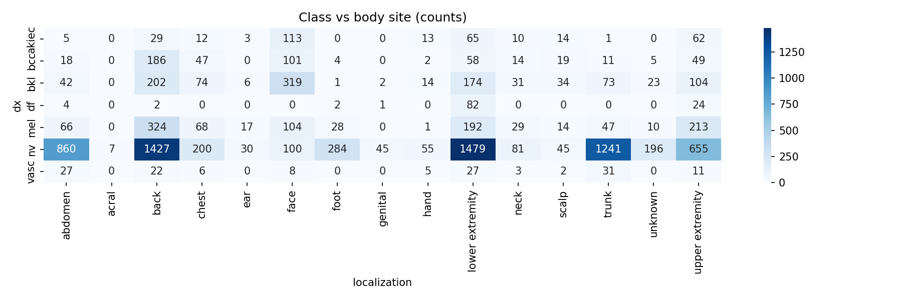 |

More: `docs/figures/fig_gradcam_examples.png` (heatmap examples) and `docs/figures/fig_samples.png` (sample images per class).

### Model design

- **Proposed model:** EfficientNet-B3, pretrained on ImageNet and fine-tuned, final layer replaced with 7 outputs. Uses SiLU activations, depthwise convolutions and squeeze-and-excitation blocks. 300 by 300 input.
- **Baseline:** MobileNetV2 with the same training setup.
- **Training:** AdamW optimiser, cosine learning-rate schedule, class-weighted loss (to handle the imbalance), image augmentation, early stopping on validation macro F1. EfficientNet-B3 trained for 14 epochs, MobileNetV2 for 10.
- **Explainability:** Grad-CAM on the last feature layer of the network.

The full architecture printout, code and charts are in `notebooks/skin_lesion_training.ipynb`.

## 5. Designs and screenshots

These are real screenshots of the running app (see `docs/screenshots/`). The sample images may have been in the training data, so the screenshots show the interface, not accuracy.

**Home screen: add a photo, with the limitations shown up front**

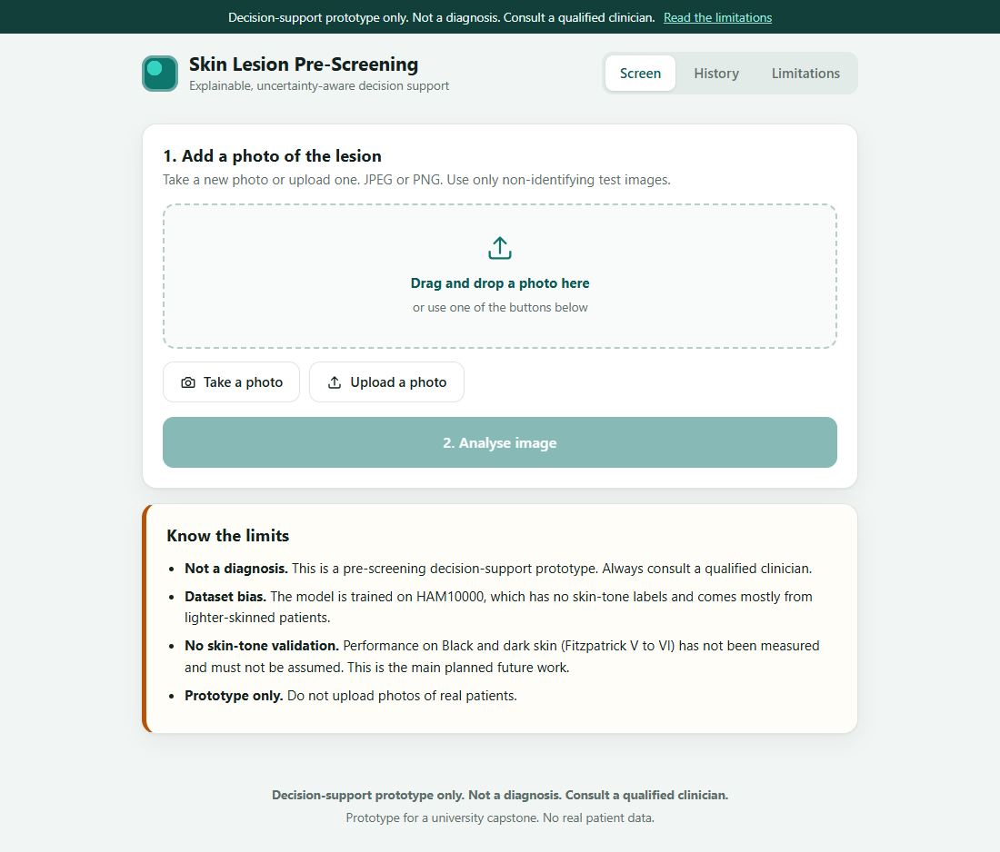

**Take a photo with the camera.** This screenshot was taken with a browser test camera (the green pattern), so it only shows the layout. On a real device it shows your live camera.

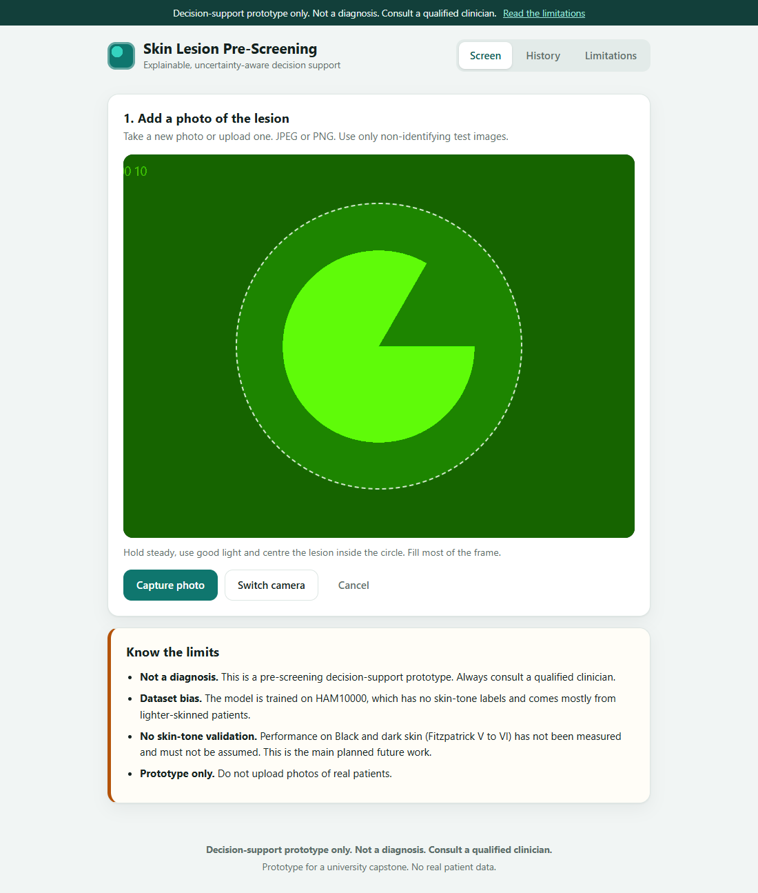

**Upload with preview**

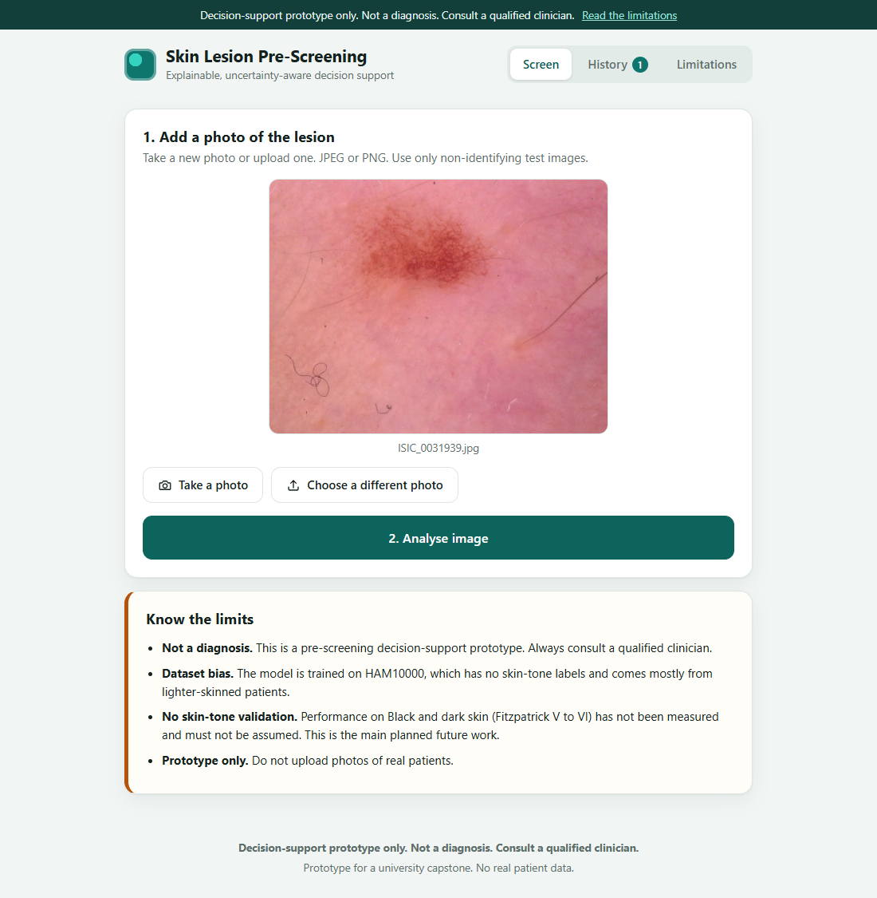

**Result with a high-uncertainty "Review recommended" banner**

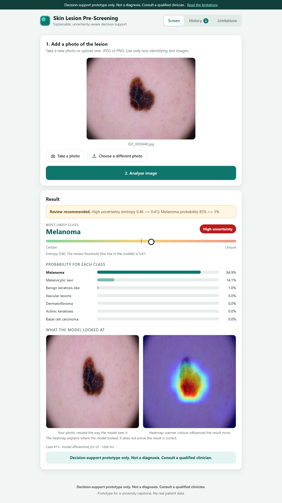

**Result with low uncertainty (no banner)**

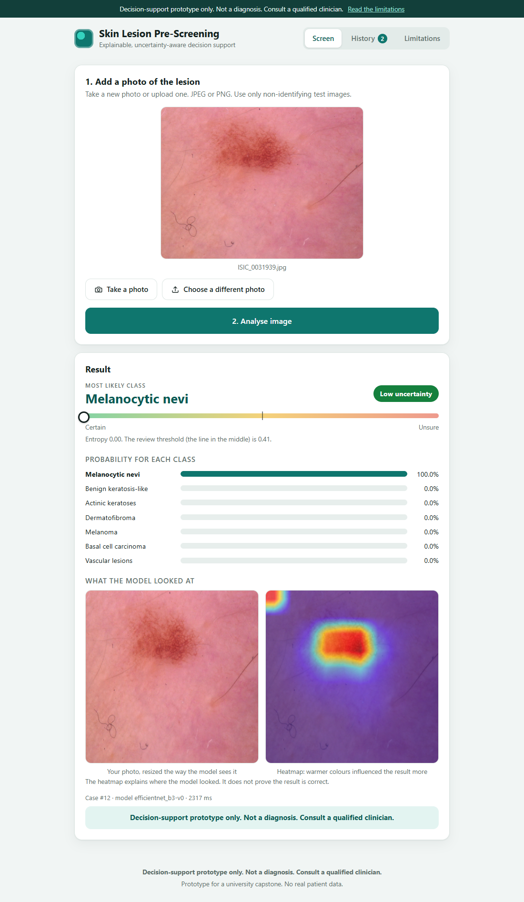

Note: the same image can give slightly different probabilities each time, because MC Dropout is random. Images close to the entropy threshold can flip between flagged and not flagged from one run to the next.

**Quality checks reject bad input**

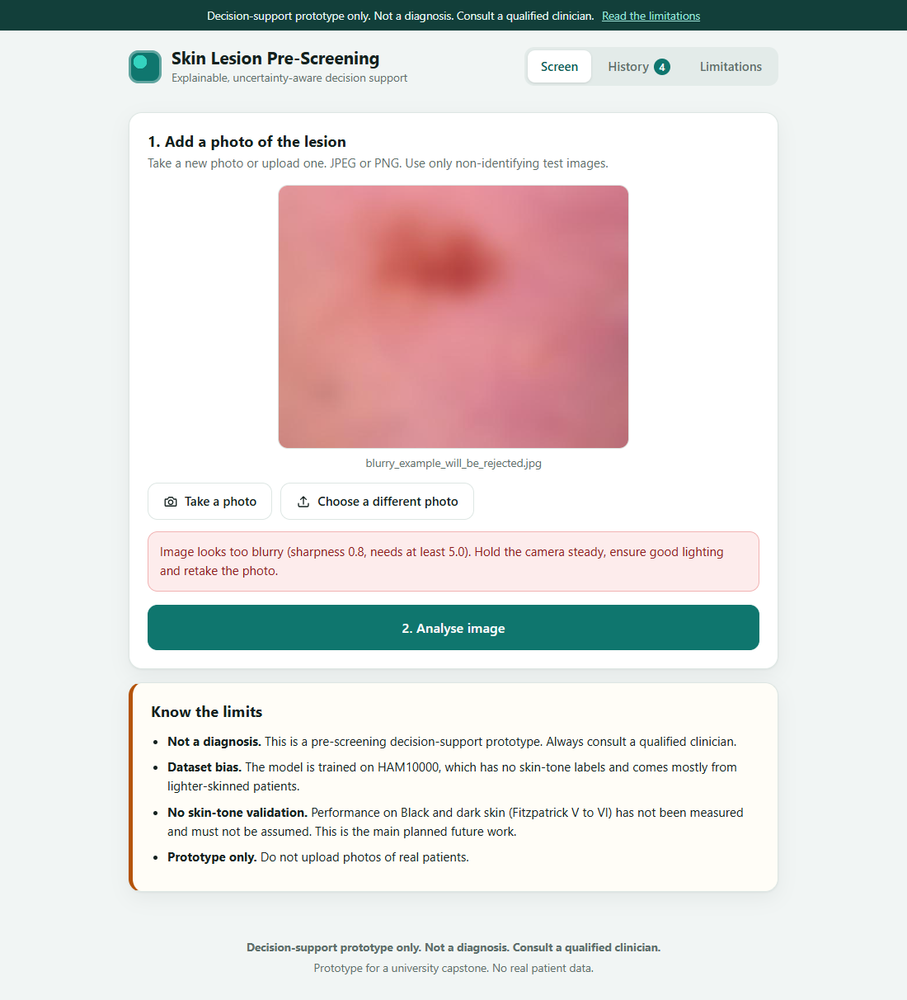
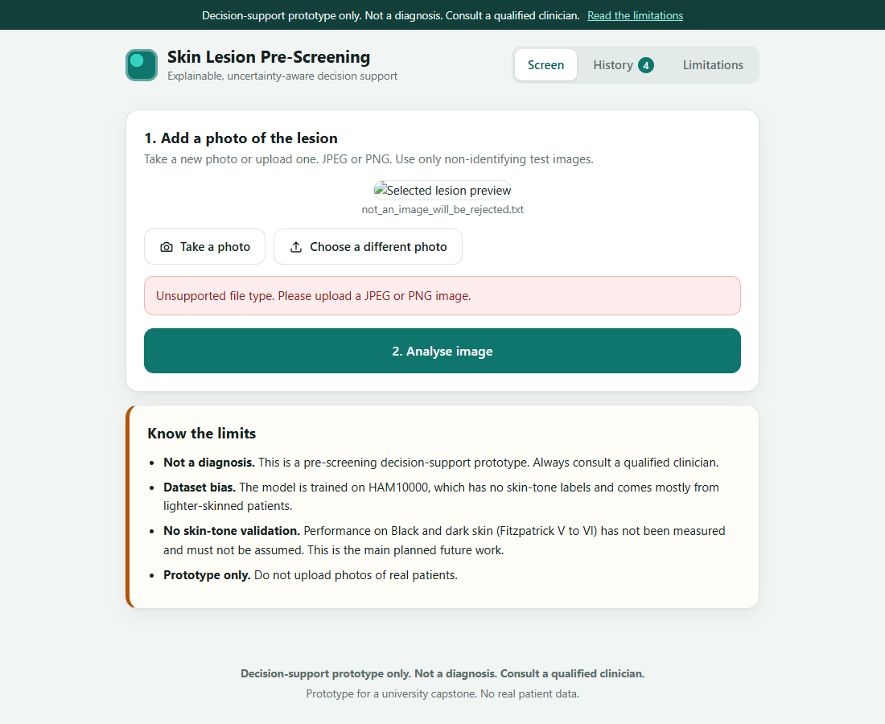

**Case history**

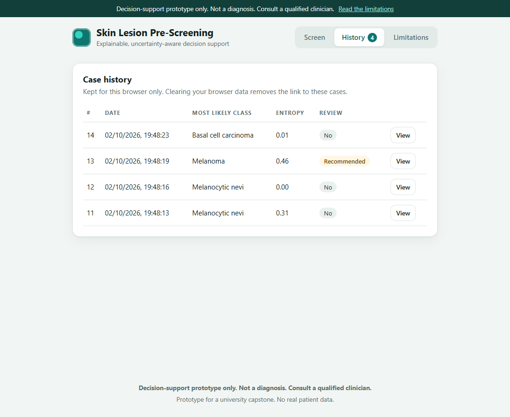

**Limitations panel**

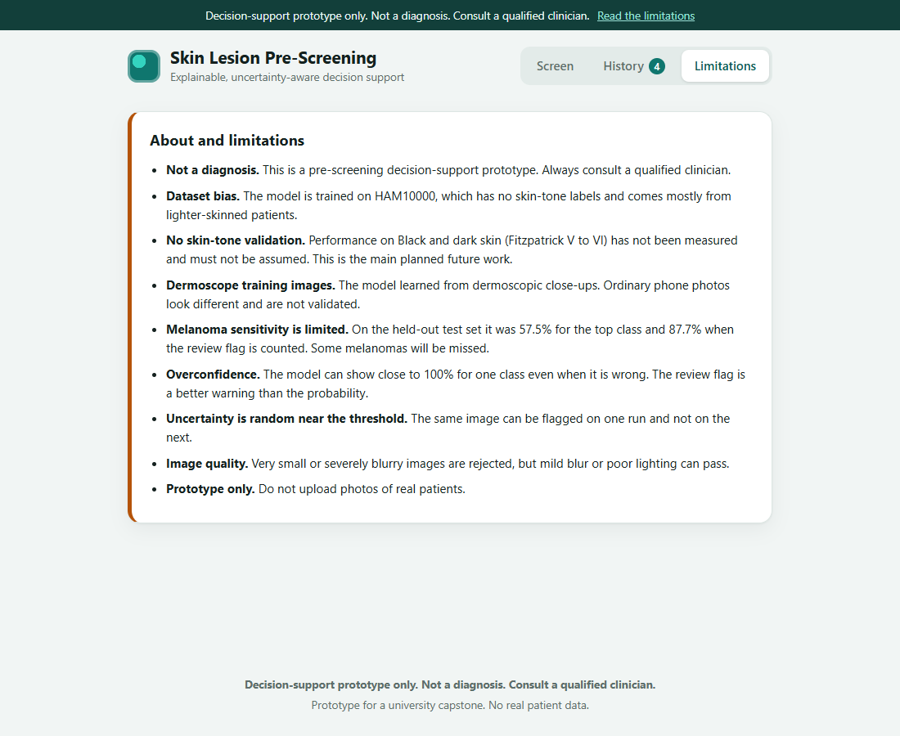

**API page (Swagger UI)**

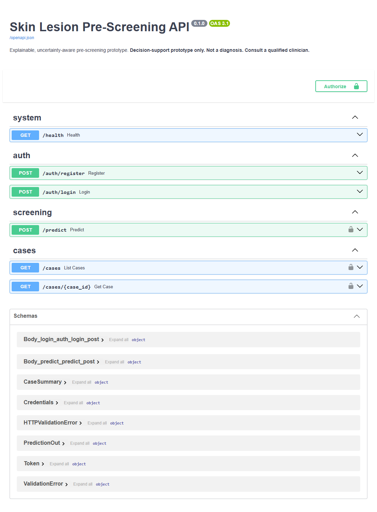

**Phone-width layout**

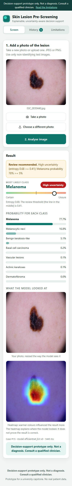

## 6. API summary

Full interactive docs at http://localhost:8000/docs.

| Method and path | What it does | Login needed |
|---|---|---|
| `GET /health` | Server status and whether the model loaded | No |
| `POST /auth/register` | Create an account, returns a token | No |
| `POST /auth/login` | Log in, returns a token | No |
| `POST /predict` | Upload an image (JPEG or PNG), get the prediction | Yes |
| `GET /cases` | List your past cases | Yes |
| `GET /cases/{id}` | Get one past case with its heatmap | Yes |

Upload checks, each with a clear error message: file type (JPEG or PNG only, 415), size (max 8 MB, 413), resolution (at least 224 px on each side, 422) and severe blur (422).

Each prediction returns: `case_id`, `predicted_class`, `class_name`, `probabilities` (all 7), `entropy`, `entropy_threshold`, `review_recommended`, `review_reason`, `heatmap_base64`, `model_version`, `disclaimer` and `inference_ms`.

Try it in Swagger UI: open `/docs`, use `/auth/register` to create an account, click **Authorize** and enter the same email and password, then try `/predict`.

The web app has no login screen. It calls `/auth/register` and `/auth/login` for you in the background, with a random anonymous account stored in your browser.

## 7. Deployment plan

### Today: local development

SQLite database, run with `uvicorn` and `npm run dev` (Quick start above). Good for demos.

### Production path: Docker Compose with PostgreSQL

`docker-compose.yml` runs three containers: PostgreSQL (database), the API, and the web app served by nginx.

```
1. Install Docker
2. Copy .env.example to .env and fill in SECRET_KEY and POSTGRES_PASSWORD
3. docker compose up --build
4. Web app: http://localhost:8080    API docs: http://localhost:8000/docs
```

Status: the Compose file passes `docker compose config` validation. A full image build and run has **not yet been tested end to end**. Treat it as the documented plan until that test is done.

### Steps to go from prototype to a real pilot

1. **Host:** one small cloud virtual machine in or near the region (a CPU is enough, no GPU needed for one image at a time).
2. **HTTPS:** put a reverse proxy (for example Caddy or nginx with Let's Encrypt) in front, and update `CORS_ORIGINS` and `VITE_API_URL` to the real domain.
3. **Secrets:** keep `.env` on the server only, never in Git. Rotate `SECRET_KEY` if it ever leaks.
4. **Data:** back up the PostgreSQL volume regularly. Uploaded images are stored in a separate volume and should be deleted on a schedule unless a clinical protocol requires keeping them.
5. **Privacy and ethics:** before any use with real patients, get ethics approval and patient consent, and follow Rwandan data protection law. Until then, use non-identifying test images only.
6. **Clinical validation:** run a supervised study comparing the tool against dermatologists, with results split by skin tone, before any pilot.
7. **Monitoring:** log request counts, error rates and the share of images flagged for review. A sudden jump in flags can mean the incoming photos look different from the training data.
8. **Low-bandwidth option for later:** the lighter MobileNetV2 model could run on a phone, but only after its melanoma sensitivity improves (currently 41.8%).

## 8. Limitations

Please read these.

1. **Not a diagnosis.** This is decision support for pre-screening. A person with a concerning lesion needs a qualified clinician no matter what this app says.
2. **Dark skin is not validated.** HAM10000 has no skin-tone labels and comes mostly from lighter-skinned patients. No result here says anything about performance on Black or dark skin (Fitzpatrick V to VI). That is an open question and the main future work. The model may well do worse on dark skin.
3. **Melanoma detection is not good enough.** Test sensitivity is 57.5% for the top class and 87.7% when counting the review flag. Missing melanomas is the most serious kind of error.
4. **Dermoscope images, not phone photos.** The training images are dermoscopic close-ups. Ordinary phone photos look different, and the model has not been tested on them.
5. **Overconfidence.** The model often gives one class close to 100%, even on a difficult image. A high probability does not mean the answer is correct. The review flag is a better warning than the probability.
6. **The flag is random near the threshold.** MC Dropout is stochastic, so the same image can be flagged on one run and not on the next.
7. **Small classes.** Dermatofibroma (9 test images) and vascular lesions (21) have too few examples for reliable scores.
8. **Blur check is coarse.** It was calibrated on 43 HAM10000 images and only catches severe blur. A mildly blurry or badly lit photo can pass.
9. **Sample images may be training images.** Results on `sample_images/` and in the screenshots are not accuracy evidence.
10. **No real patient data.** The app is a prototype. Do not upload photos of real patients.

### Planned next steps for skin tone

Evaluate on a diverse external set that has skin-tone labels and report sensitivity by skin tone. Candidates to investigate, with licences to be checked first: Diverse Dermatology Images, Fitzpatrick17k and PAD-UFES-20. Then consider fine-tuning on that data. No improvement will be claimed until it is measured.

## 9. Retraining the model

1. Open `notebooks/skin_lesion_training.ipynb` in Google Colab and set the runtime to GPU.
2. Run the cells in order. When asked, upload your own `kaggle.json` (never commit it to Git). Training saves checkpoints to Google Drive after every epoch, so if Colab disconnects you can rerun and it continues.
3. At the end it produces `efficientnet_b3_best.pth` and `model_config.json`. Copy both into `backend/model/` and restart the backend.

The backend follows this contract exactly: resize straight to 300 by 300 with ImageNet normalisation, 10 MC Dropout passes on the classifier only, and a review flag from entropy or melanoma probability.

## 10. Data, licences and credits

- **Dataset:** HAM10000. Tschandl P, Rosendahl C, Kittler H. "The HAM10000 dataset, a large collection of multi-source dermatoscopic images of common pigmented skin lesions." Scientific Data, 2018. Licence: CC BY-NC 4.0 (non-commercial use with attribution; please verify before any other use).
- **Sample images** in `sample_images/` are taken from HAM10000 under that licence, for trying the interface only.
- **Model:** EfficientNet-B3 and MobileNetV2 from torchvision, ImageNet pretrained weights.
- **Heatmaps:** the `pytorch-grad-cam` library.
